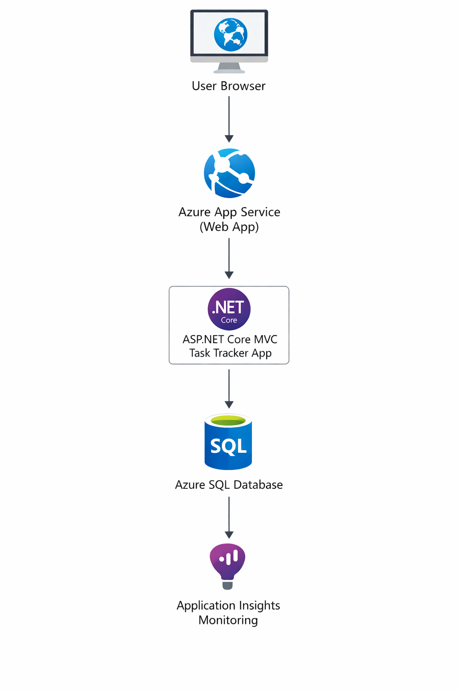

# Azure Task Tracker App

A cloud-hosted task management web application built using **ASP.NET Core MVC**, deployed on **Microsoft Azure App Service**, with **Azure SQL Database** for persistent storage.

This project demonstrates:
- Cloud deployment on Azure
- Database integration with Azure SQL
- CI/CD automation using GitHub Actions
- Application monitoring with Azure Application Insights

---

# Live Application

Live URL:

https://tasktracker-nixon-ftecekhrgac5ghde.southindia-01.azurewebsites.net

---

## Architecture Diagram

---

# CI/CD Pipeline

Deployment workflow:

Developer pushes code to GitHub  
↓  
GitHub Repository  
↓  
GitHub Actions CI/CD pipeline  
↓  
Build ASP.NET Core application  
↓  
Automatic deployment to Azure App Service  

---

# Technologies Used

- ASP.NET Core MVC
- Entity Framework Core
- Azure App Service
- Azure SQL Database
- GitHub Actions (CI/CD)
- Azure Application Insights
- Bootstrap

---

# Key Features

- Create tasks
- View tasks
- Edit tasks
- Delete tasks
- Cloud-hosted backend
- Automated CI/CD deployment
- Application monitoring

---

# Azure Services Used

- Azure App Service – hosting the web application
- Azure SQL Database – persistent data storage
- Azure Application Insights – monitoring and diagnostics

---

# Running the Project Locally

Clone the repository:

git clone https://github.com/nixon-santiago/task-tracker-azure.git

Open the solution in Visual Studio.

Update the connection string in:

appsettings.json

Run the application:

dotnet run

---

# Author

Nixon Santiago
